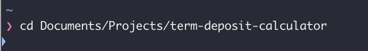
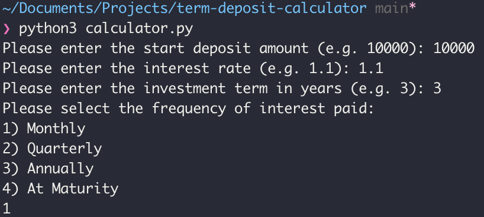
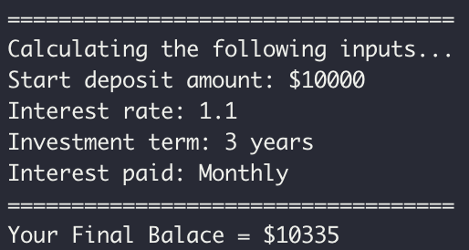

# Simple Term Deposit Calculator

## Description

A simple term deposit calculator that forecasts the return on your term deposit by using 
a start deposit amount, investment term, interest rate and frequency of interest paid to produce a final balance.

Tech stack:
- Python 3.11.1

## Installation

This program currently runs in CLI and requires you to install [Python 3](https://www.python.org/downloads/). 

### Windows
Install [Python from python.org](python.org). Use the Download Python button that appears first on the page to download the latest version.

### macOS
The system install of Python on macOS is not supported. Instead, a package management system like [Homebrew](https://brew.sh/) is recommended. To install Python using Homebrew on macOS use `brew install python3` at the Terminal prompt.

## Usage 

1. Begin by cloning this repository to the location of your choice. Here is a [tutorial on cloning a repository](https://docs.github.com/en/repositories/creating-and-managing-repositories/cloning-a-repository). 
2. Open a command-line or terminal and `cd` to the cloned directory

    

3. Run the program with the command:
    ```python
    python3 calculator.py
    ```
4. Enter the inputs required

    

5. Calculate results

    

🥳 Finished 
---